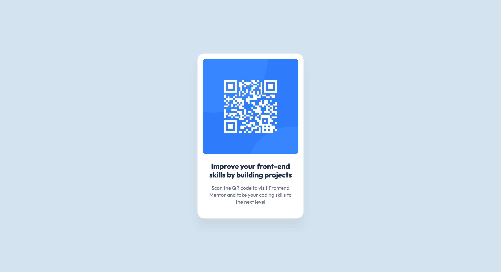

# QR Code Component

## About Project

This is a **QR code component** — a [frontend challenge project](https://www.frontendmentor.io/challenges/qr-code-component-iux_sIO_H) from **Frontend Mentor**, based on a static QR code 
card. It uses **Vite**, and styles are written using the **BEM (Block, Element, Modifier)** methodology.

---

## Preview



## Tools
* **Vite**: For development and building.
* **Sass**: Helps write better CSS code.
* **BEM (Block, Element, Modifier)**: A methodology to name CSS classes.
* **Stylelint** & **Prettier**: Check and fix how the code looks.
* **gh-pages**: Helps to deploy project.
---

## Links

- Live Site URL: [https://alex-o-drag.github.io/qr-code-component/](https://alex-o-drag.github.io/qr-code-component/)
- Solution URL: [https://github.com/alex-o-drag/qr-code-component](https://github.com/alex-o-drag/qr-code-component)
---

## Start

### Get the repository:
```bash
git clone https://alex-o-drag.github.io/qr-code-component/
cd qr-code-component
```

### Install packages:
    
```bash
npm install
```
---

## Commands
* `npm run dev`: Starts the project.
* `npm run build`: Builds the project for production..
* `npm run preview`: Shows the finished project locally.
* `npm run lint:css`: Checks CSS code.
* `npm run lint:css:fix`: Fixes CSS code.
* `npm run check-format`: Checks if the code is neat.
* `npm run format`: Makes all the code neat.
* `npm run deploy`: Used to deploy the project to GitHub Pages.